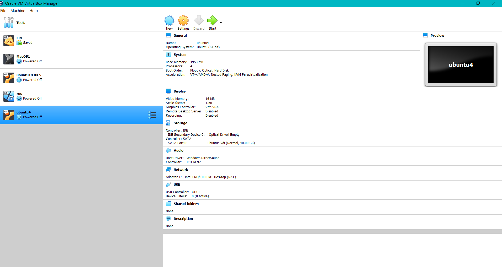

# ROS_install_Task1
## ROS Melodic system installation - task 1 for track AI at Smart-Methods summer training

1. Download [VirtualBox](https://www.virtualbox.org/wiki/Downloads)
2. Download [Ubuntu 18.04 desktop image](https://releases.ubuntu.com/18.04/) 
**or** [Ubuntu mate 18.04](https://ubuntu-mate.org/download/amd64/bionic/) 

3. create the virtual machine
see the [ubuntu system requirements](https://help.ubuntu.com/community/Installation/SystemRequirements)
[ubuntu mate system requirements](https://ubuntu-mate.org/about/requirements)

 **Install ROS melodic**
4. Configure your [Ubuntu repositories](https://help.ubuntu.com/community/Repositories/Ubuntu)  
5. Setup your sources.list  
Setup your computer to accept software from packages.ros.org.  
`sudo sh -c 'echo "deb http://packages.ros.org/ros/ubuntu $(lsb_release -sc) main" > /etc/apt/sources.list.d/ros-latest.list'`  
6. Set up your keys  
`sudo apt install curl # if you haven't already installed curl`  
`curl -s https://raw.githubusercontent.com/ros/rosdistro/master/ros.asc | sudo apt-key add -`  
7. Installation  
First, make sure your Debian package index is up-to-date:  
`sudo apt update`  
- Desktop-Full Install: (Recommended) : ROS, rqt, rviz, robot-generic libraries, 2D/3D simulators and 2D/3D perception  
`sudo apt install ros-melodic-desktop-full`  
- Desktop Install: ROS, rqt, rviz, and robot-generic libraries  
`sudo apt install ros-melodic-desktop`  
- ROS-Base: (Bare Bones) ROS package, build, and communication libraries. No GUI tools.  
`sudo apt install ros-melodic-ros-base`  
8. Environment setup  
It's convenient if the ROS environment variables are automatically added to your bash session every time a new shell is launched:  
`echo "source /opt/ros/melodic/setup.bash" >> ~/.bashrc`  
`source ~/.bashrc`  
9. Dependencies for building packages  
`sudo apt install python-rosdep python-rosinstall python-rosinstall-generator python-wstool build-essential`  
10. Initialize rosdep  
`sudo apt install python-rosdep`  
`sudo rosdep init`  
`rosdep update`  
